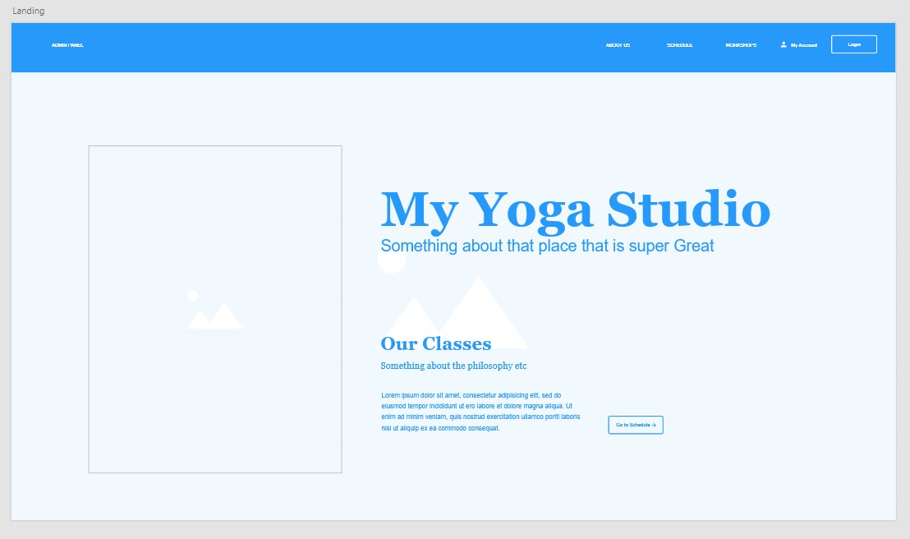
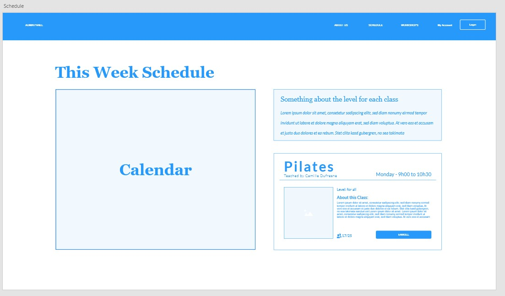
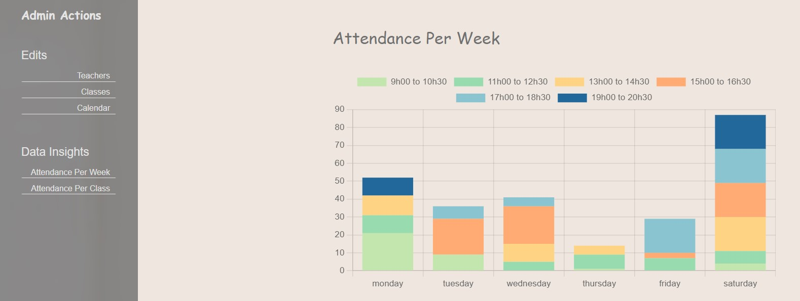
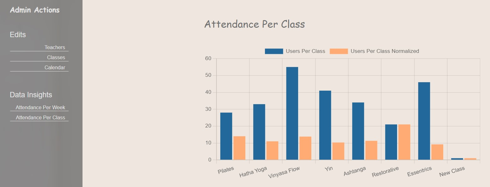

# Class-Booking-System
Concordia Full Stack Developper Bootcamp - **Final Project**.

## Brief
This project aims at creating a system where a user can view a weekly calendar of classes (yoga in this context). 

This project focuses heavily on the admin side of the website, offering multiple representation of several data set, like, for instance, the number of classes booked in a week , the reservations through the week , through a day, per class,  per teachers on so on

**class presentation** : https://www.youtube.com/watch?v=ffqfMV6kSrk

## Functionnalities

### Website
    - Landing page
    - Login with admin and user roles (protected routes)
    - A calendar generated from the database with classes that can be booked
    - User profile page
    - Admin panel page, with admin functionalities
    - About (me)
    - 404

### Users
    - book and remove a class
    - see profil

### Admin
    - add a teacher
    - add a class (assign a teacher to it)
    - assign a class to the calendar (day and time slot)
    - view data attendence per days of the week
    - view data attandence per class

## WireFrame (AdobeXd)



## HD Prototype


## Data Visualization



## Install

 - cd frontend then 
```console
   yarn install
```
 - cd server then 
 ```console
   yarn install
```

### BatchImport and Data Generation

    cd xDataImport
- use node batchimport.js to import the data in the mongoDb database (your own .env file).
- use generate_db_data.js if you want to generate a different batch of users.

### Run the App
    in the frontend folder run yarn start
    in the server folder run yarn start:server

## Endpoint Specification
[API Endpoints](./server/ENDPOINTS_SPECIFICATION.md)
